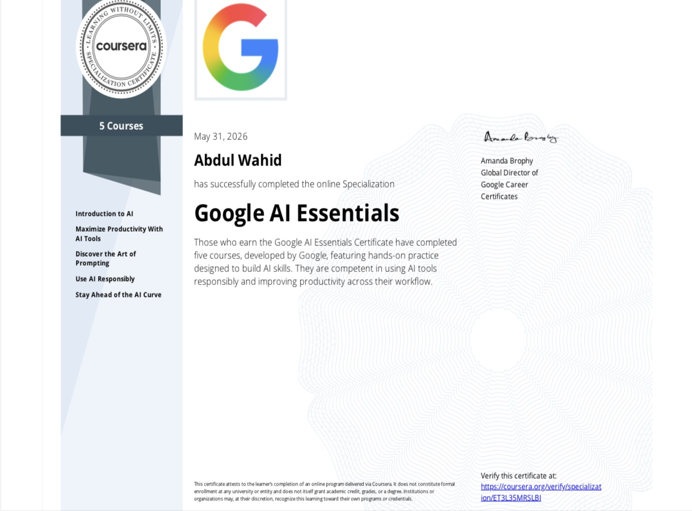

# Google AI Essentials — Specialization Certificate

> **Abdul Wahid** has successfully completed the online Specialization on May 31, 2026

---

## 📋 Certificate Details

| Detail | Info |
|---|---|
| **Issued By** | Google |
| **Platform** | Coursera |
| **Issued To** | Abdul Wahid |
| **Date Completed** | May 31, 2026 |
| **Type** | Specialization Certificate |
| **Total Courses** | 5 |
| **Signed By** | Amanda Brophy, Global Director of Google Career Certificates |
| **Verify** | [🔗 https://coursera.org/verify/specialization/ET3L35MRSLBI](https://coursera.org/verify/specialization/ET3L35MRSLBI) |

---

## 📚 Courses Completed

| # | Course |
|---|---|
| 1 | **Introduction to AI** |
| 2 | **Maximize Productivity With AI Tools** |
| 3 | **Discover the Art of Prompting** |
| 4 | **Use AI Responsibly** |
| 5 | **Stay Ahead of the AI Curve** |

---

## 📝 About This Certificate

Those who earn the Google AI Essentials Certificate have completed five courses, developed by Google, featuring hands-on practice designed to build AI skills. They are competent in using AI tools responsibly and improving productivity across their workflow.

---

## 🧠 Skills Gained

- ✅ Using AI tools for everyday productivity
- ✅ Effective prompt engineering techniques
- ✅ Understanding of AI ethics and responsible use
- ✅ Awareness of emerging AI trends and technologies
- ✅ Hands-on experience with Google's AI-powered tools

---

## 🔍 Verify Certificate

**🔗 [https://coursera.org/verify/specialization/ET3L35MRSLBI](https://coursera.org/verify/specialization/ET3L35MRSLBI)**

> _This certificate attests to the learner's completion of an online program delivered via Coursera. It does not constitute formal enrollment at any university or entity and does not itself grant academic credit, grades, or a degree. Institutions or organizations may, at their discretion, recognize this learning toward their own programs or credentials._

---

  <i>📅 Completed: May 31, 2026 &nbsp;|&nbsp; 🏅 Issued by Google via Coursera</i>

