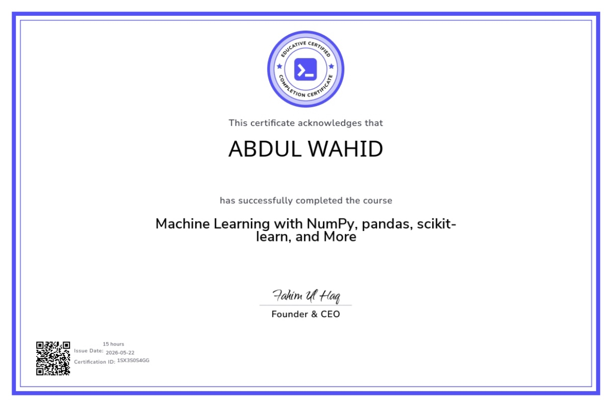

# Machine Learning with NumPy, pandas, scikit-learn, and More

> **Abdul Wahid** has successfully completed the course on May 22, 2026

---

## 📋 Certificate Details

| Detail | Info |
|---|---|
| **Certificate Type** | Course Completion Certificate |
| **Course Name** | Machine Learning with NumPy, pandas, scikit-learn, and More |
| **Issued To** | Abdul Wahid |
| **Issue Date** | May 22, 2026 |
| **Duration** | 15 Hours |
| **Platform** | Educative |
| **Certification ID** | 1SX3S0S4GG |
| **Signed By** | Fahim Ul Haq, Founder & CEO of Educative |
| **Verify** | [🔗 View Certificate](https://drive.google.com/file/d/1UGs2P9JgDlXth--FgMtQXr_n10pAjnsu/view) |

---

## 📝 About This Course

This course provides comprehensive hands-on training in the most essential Python libraries used in Machine Learning. It covers the full ML pipeline — from data manipulation and analysis to building and evaluating predictive models — using industry-standard tools.

---

## 📚 Topics Covered

| Topic | Description |
|---|---|
| **NumPy** | Numerical computing, arrays, matrix operations |
| **pandas** | Data manipulation, DataFrames, data cleaning |
| **scikit-learn** | ML algorithms, model training, evaluation |
| **Data Preprocessing** | Handling missing values, encoding, scaling |
| **Supervised Learning** | Regression and classification models |
| **Model Evaluation** | Accuracy, precision, recall, confusion matrix |

---

## 🧠 Skills Gained

- ✅ NumPy for numerical computing and array operations
- ✅ pandas for data manipulation and analysis
- ✅ Building ML models with scikit-learn
- ✅ Data preprocessing and feature engineering
- ✅ Training and evaluating supervised learning models
- ✅ End-to-end machine learning pipeline

---

## 🛠️ Tools & Technologies

  
  
  
  

---

## 🔍 Verify Certificate

**🔗 [https://drive.google.com/file/d/1UGs2P9JgDlXth--FgMtQXr_n10pAjnsu/view](https://drive.google.com/file/d/1UGs2P9JgDlXth--FgMtQXr_n10pAjnsu/view)**

> _This certificate acknowledges that the learner has successfully completed the course on the Educative platform. Certification ID: 1SX3S0S4GG_

---

  <i>📅 Completed: May 22, 2026 &nbsp;|&nbsp; ⏱️ Duration: 15 Hours &nbsp;|&nbsp; 🏅 Issued by Educative</i>

