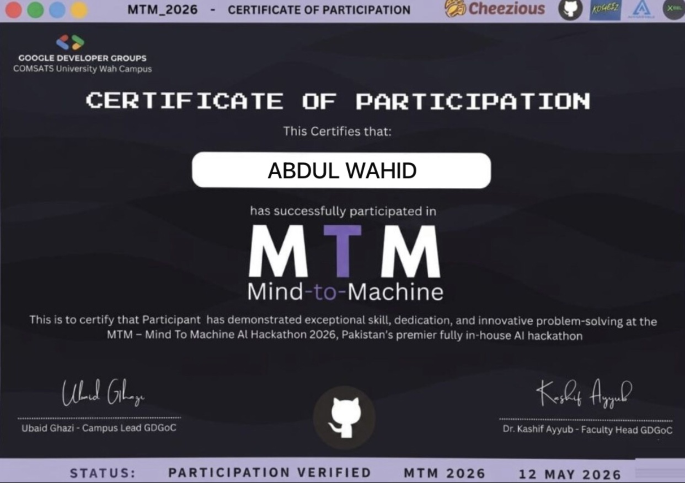

# MTM — Mind-to-Machine AI Hackathon 2026

> **Abdul Wahid** has successfully participated in the MTM — Mind-to-Machine AI Hackathon 2026

---

## 📋 Certificate Details

| Detail | Info |
|---|---|
| **Certificate Type** | Certificate of Participation |
| **Event Name** | MTM — Mind-to-Machine AI Hackathon 2026 |
| **Issued To** | Abdul Wahid |
| **Date** | May 12, 2026 |
| **Organized By** | Google Developer Groups — COMSATS University Wah Campus |
| **Status** | Participation Verified |
| **Signed By** | Ubaid Ghazi (Campus Lead GDGoC) & Dr. Kashif Ayyub (Faculty Head GDGoC) |
| **Verify** | [🔗 View Certificate](https://drive.google.com/file/d/1UGs2P9JgDlXth--FgMtQXr_n10pAjnsu/view) |

---

## 🏆 About the Event

**MTM (Mind-to-Machine)** is Pakistan's premier fully in-house AI Hackathon, organized by Google Developer Groups at COMSATS University Wah Campus. The event brought together talented developers, engineers, and AI enthusiasts to solve real-world problems using artificial intelligence.

Participants demonstrated exceptional skill, dedication, and innovative problem-solving throughout the hackathon.

---

## 🤝 Sponsors & Partners

| Partner | Role |
|---|---|
| **Cheezious** | Sponsor |
| **GitHub** | Partner |
| **Kogez** | Partner |
| **Xcel** | Partner |

---

## 🧠 Skills Demonstrated

- ✅ AI problem-solving under pressure
- ✅ Innovative thinking and creative solutions
- ✅ Teamwork and collaboration
- ✅ Hands-on AI/ML development
- ✅ Real-world AI application building

---

## 🏫 Organizer

**Google Developer Groups (GDGoC)**
COMSATS University Wah Campus

| Role | Name |
|---|---|
| Campus Lead GDGoC | Ubaid Ghazi |
| Faculty Head GDGoC | Dr. Kashif Ayyub |

---

## 🔍 Verify Certificate

**🔗 [https://drive.google.com/file/d/1UGs2P9JgDlXth--FgMtQXr_n10pAjnsu/view](https://drive.google.com/file/d/1UGs2P9JgDlXth--FgMtQXr_n10pAjnsu/view)**

---

  <i>📅 Event Date: May 12, 2026 &nbsp;|&nbsp; 🏅 Organized by GDGoC — COMSATS University Wah Campus</i>

